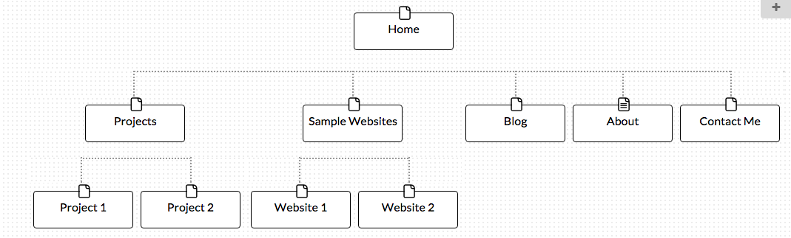

# My site map:

* **What are the 6 Phases of Web Design?**
	* Thex six phases of web design are:
		1. Information Gathering - Thoroughly understanding the website's purpose, goals, target audience, and content.
		2. Planning - Develop a site map for your web site as well as decide on technologies to be implemented.
		3. Design - Determine the look and feel of the project, often by creating multiple prototypes of the web site.
		4. Development - Developing the prototype into a full, functioning web site.  
		5. Testing and Delivery - Testing various pieces of the code to ensure that the web site is fully functioning.  The files can then be delivered to be hosted on the client's web server.  
		6. Maintenance - Developing additional content as well as performing maintenance tasks such as site backups, plugin installation, and upgrades.  
* **What is your site's primary goal or purpose?  What kind of content will your site feature?**
	* My site will primarily function as a portfolio for employers to see samples of my work.  It will showcase my coding projects as well as other websites that I work on.  They will also have a chance to see my resume and other samples of my work (i.e blog posts).
* **What is your target audience's interests and how do you see your site addressing them?**
	* My site's target audience would primarily be employers who are interested in seeing my work.  My site would address them by showcasing the projects/sites I have designed on the main page of the site and designing all the content around them.  
* **What is the primary "action" the user should take when coming to your site?  Do you want them to search for information, contact you, or see your portfolio?  It's ok to have several actions at once, or different actions for different kinds of visitors.**
	* For future employers, I want their primary action to be to view my portfolio and then be able to find my contact information if they are impressed with my work.  Other users will be able to locate my blog posts and find more information on a topic they are interested in.
* **What are the main things someone should know about design and user experience?**
	* Designing for user experience is a key component of any website, particularly websites that are complex.  Although hard to measure, providing a good user experience can result in many more people visiting and using the site.  You can design for user experience by getting feedback on various workflows and doing A/B testing.
* **What is user experience design and why is it valuable?**
	* User experience design is so valuable because it addresses how an end-user would feel when using a site.  Sometimes the end-user is forgotten as the focus is often on the client's needs or using a new technology.  User experience design keeps the user as the primary focus and various workflows are created with a thorough understanding of how an end-user might interact with the design.
* **Which parts of the challenge did you find tedious?**
	* I found that there was just a vast amount of information to take in, which at times could be tedious.  There was a lot of techniques described, but not enough of an opportunity to use that knowledge or drill the knowledge into my mind.  
