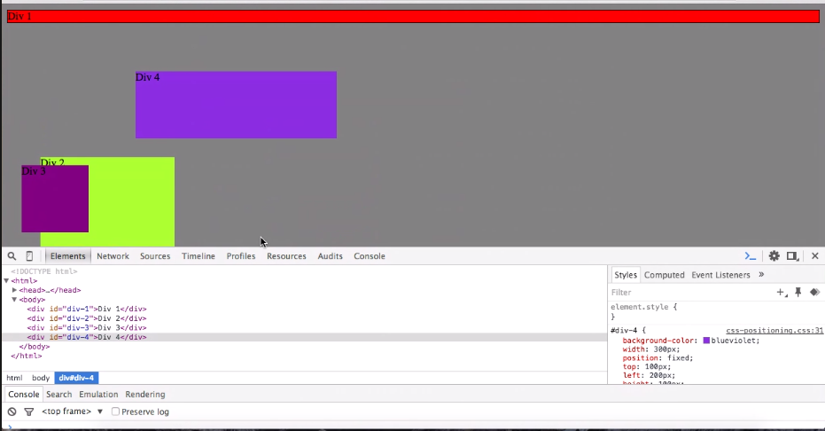
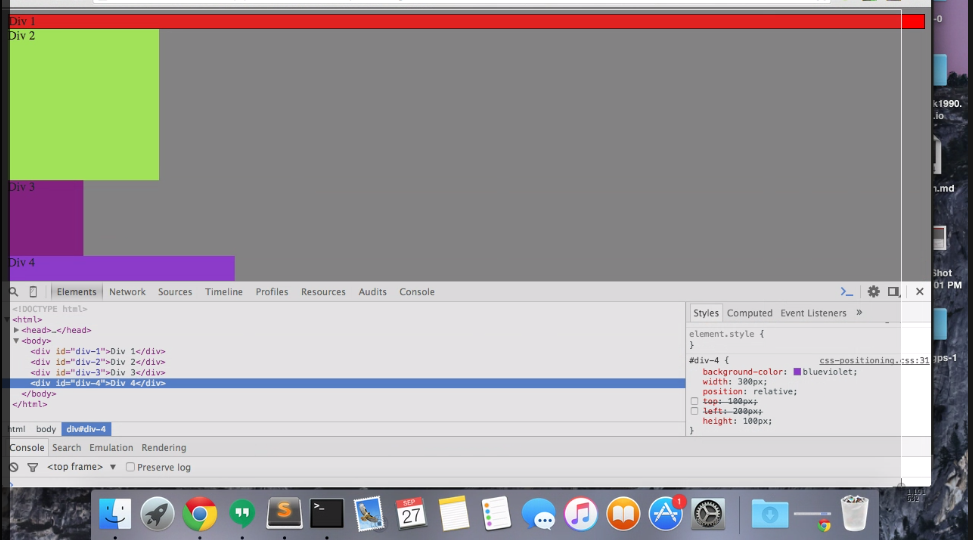
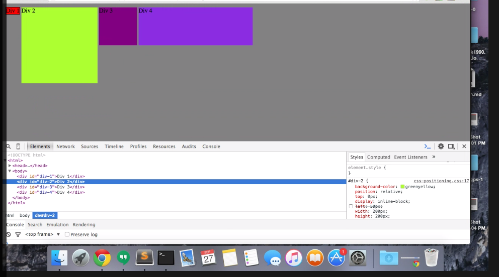
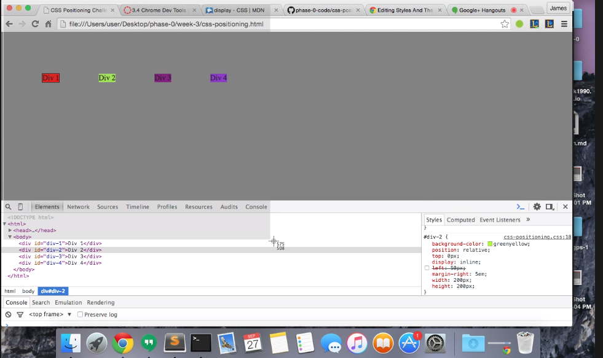
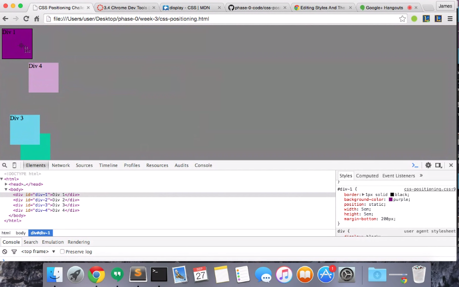
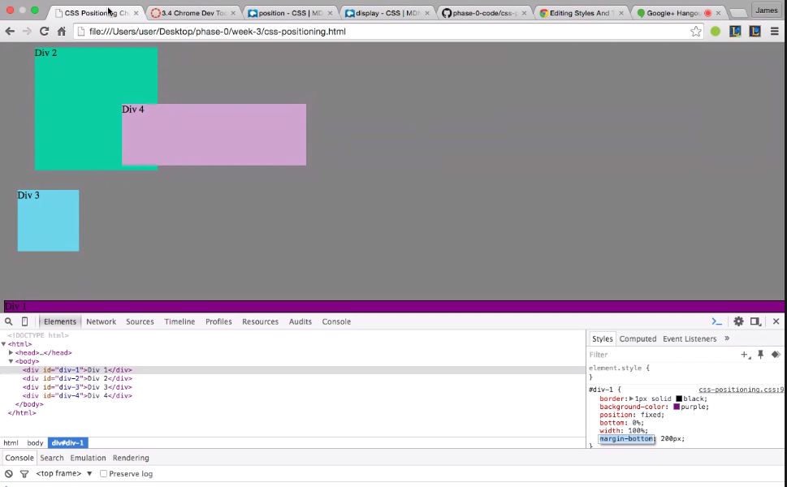
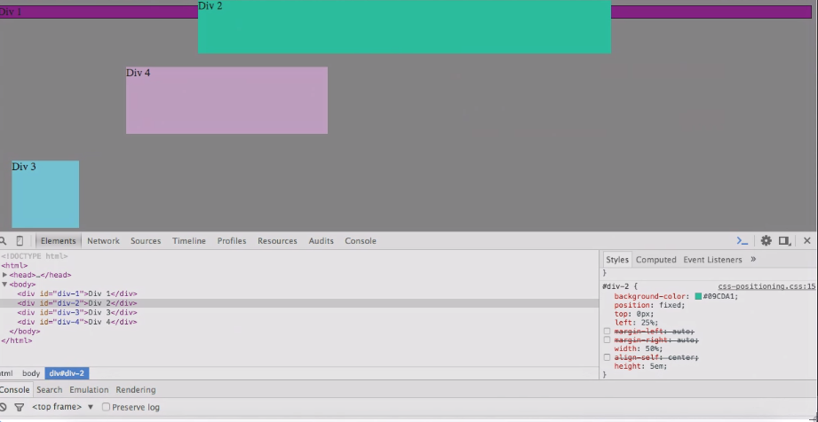
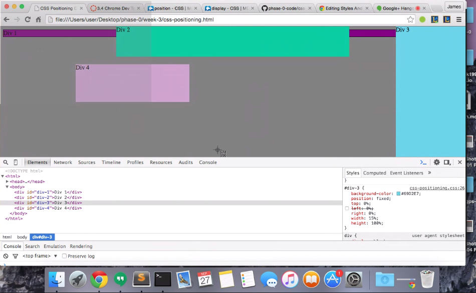
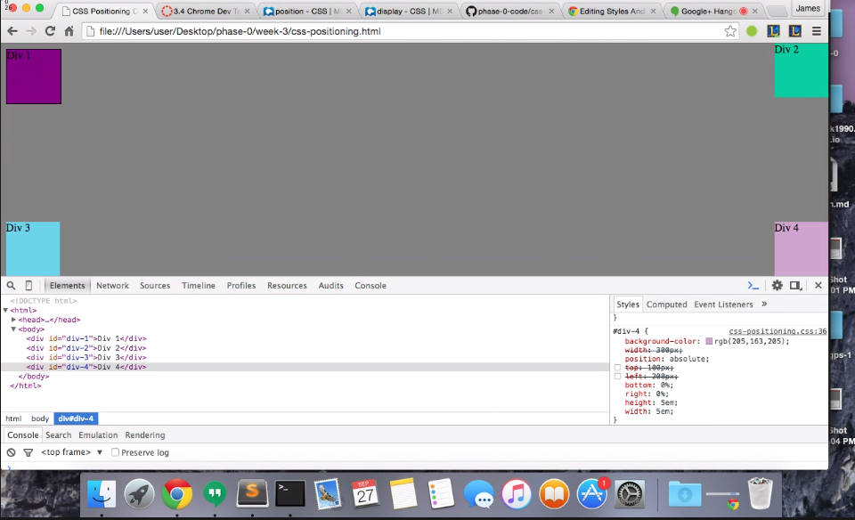

* **Exercise 1: Change the Colors

* **How can you use Chrome's DevTools inspector to help you format or position elements?**
  * You can use Chrome DevTools to format or position elements by investigating them with the DevTools.  You can look at the various elements and update their properties.  You can update their color, width, height, and position and see how it looks in the browser immediately.
* **How can you resize elements on the DOM using CSS?**
  * Elements can be resized by adjusting the width or the height properties of the elements.
* **What are the differences between Absolute, Fixed, Static, and Relative positioning? Which did you find easiest to use? Which did you find most difficult?**
  * Absolute positioning places the object based on the actual page. Relative positioning places the object on where the object should go in-the-flow.  Static is the normal position that the object should go.  Fixed puts the object in a fixed position that stays the same even when you scroll.
* **What are the differences between Margin, Border, and Padding?**
  * Margin is the extra space outside of the border.  Padding is additional space between the border and your content area.
* **What was your impression of this challenge overall? (love, hate, and why?)
  * Overall, I thought this challenge was insightful.  It was a bit tedious at times but overall we learned a lot about the different CSS elements and how they worked.  We also realized the value of Chrome DevTools and intend to use it a lot when working on our own pages.