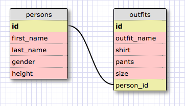

# Exercises
*  1. Select all data for all states.

```
SELECT * FROM states;
```

* 2. Select all data for all regions.

```
SELECT * from regions;
```

* 3. Select the state_name and population for all states.

```
SELECT state_name, population
FROM states;
```

* 4. Select the state_name and population for all states ordered by population. The state with the highest population should be at the top.

```
SELECT state_name, population
FROM states
ORDER BY population DESC;
```

* 5. Select the state_name for the states in region 7

```
SELECT state_name
FROM states
WHERE region_id=7;
```

* 6. Select the state_name and population_density for states with a population density over 50 ordered from least to most dense.

```
SELECT state_name, population_density
FROM states
WHERE population_density>50
ORDER BY population_density;
```

* 7. Select the state_name for states with a population between 1 million and 1.5 million people

```
SELECT state_name
FROM states
WHERE population > 1000000 AND population < 1500000;
```

* 8. Select the state_name and region_id for states ordered by region in ascending order.

```
SELECT state_name, region_id
FROM states
ORDER BY region_id;
```

* 9. Select the region_name for the regions with "Central" in the name.

```
SELECT region_name
FROM regions
WHERE region_name LIKE '%Central$';
```

* 10. Select the region_name and state_name for all states and regions in ascending order by region_id. Refer to the region by name. (This will involve joining the tables).

```
SELECT regions.region_name, states.state_name
FROM states
INNER JOIN regions
ON states.region_id=regions.id
ORDER BY region_id;
```

# Table


# Reflection
* **What are databases for?**
  * Databases are used to store large amounts of data persistently. They can be used for quick data recall.
* **What is one-to-many relationship?**
  * A one-to-many relationship is a relationship where the foreign key of one table refers to many different tables.
* **What is a primary key? What is a foreign key? How can you determine which is which?**
  * A primary key is a unique identifier for a row in a table. A foreign key is a field that is a primary key in a different table.
* **How can you select information out of a SQL database? What are some general guidelines for that?**
  * You can select information out of tables in a SQL database. You can narrow down the columns or rows you want by giving arguments to SELECT and WHERE.